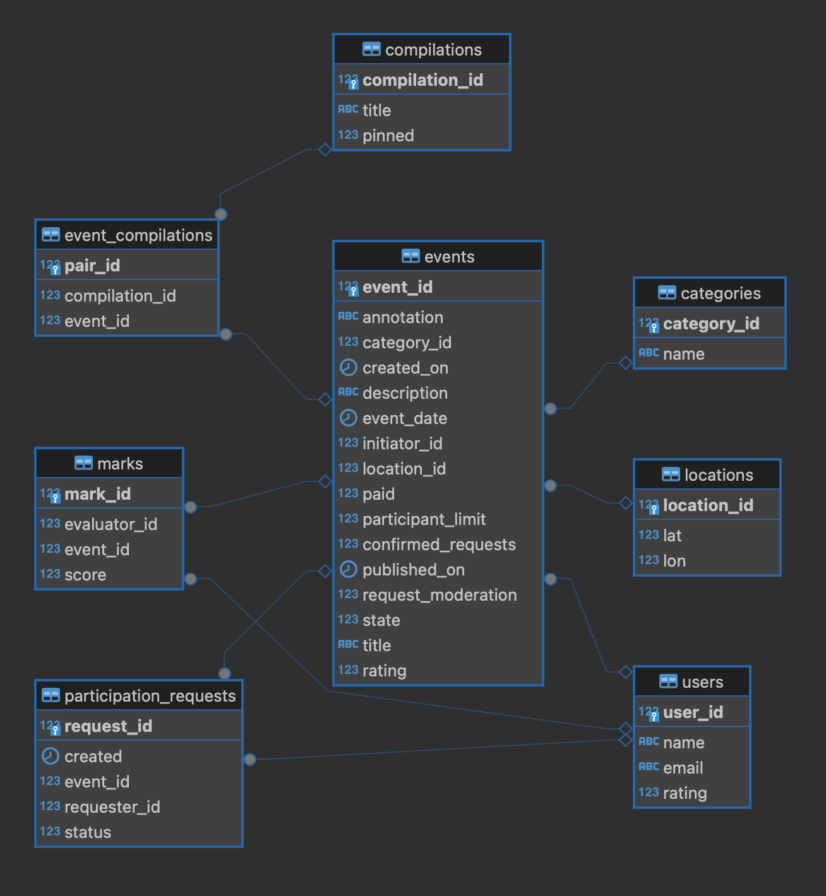

# Реализация проекта Explore With Me
##### Бэкенд сервиса, позволяющего пользователям делиться информацией об интересных мероприятиях, находить компанию для участия в них, а так же оценивать события и их инициаторов.
##### Использовались технологии: Spring Boot, REST, Lombok, Hibernate, PostgreSQL, Микросервисы, Docker, создание тестовых коллекций Postman.
### Развёртывание проекта
1. Проект выполнен на Amazon Coretto JDK 11; версия Spring Boot 2.7.9.
2. На компьютере, где планируется использовать проект, должен быть установлен Docker.
3. Для развёртывания проекта перейдите в терминале в папку проекта, и наберите команду "docker-compose up".

### Схема основной базы данных

###  Описание таблиц базы данных
##### Users - содержит информацию о пользователях сервиса
| № | Column Name | Description    | Type    | Key | Reference |
|---|-------------|----------------|---------|-----|-----------|
| 1 | User_id     | Identifier     | integer | PK  |           |
| 2 | Name        | Name           | varchar |     |           |
| 3 | Email       | Email          | varchar |     |           |
| 4 | Rating      | Rating of user | integer |     |           |
---
##### Events - содержит информацию о мероприятиях
| №  | Column Name        | Description                        | Type    | Key | Reference  |
|----|--------------------|------------------------------------|---------|-----|------------|
| 1  | Event_id           | Identifier                         | integer | PK  |            |
| 2  | Annotation         | Short summary                      | varchar |     |            |
| 3  | Category_id        | Category Identifier                | integer | FK  | Categories |
| 4  | CreatedOn          | Date of creation                   | date    |     |            |
| 5  | Description        | Full description                   | varchar |     |            |
| 6  | EventDate          | Date of event                      | date    |     |            |
| 7  | Initiator_id       | Initiator Identifier               | integer | FK  | Users      |
| 8  | Location_id        | Location Identifier                | integer | FK  | Locations  |
| 9  | Paid               | Free or not                        | integer |     |            |
| 10 | ParticipantLimit   | Limit of participants              | integer |     |            |
| 11 | ConfirmedRequests  | Confirmed requests                 | integer |     |            |
| 12 | PublishedOn        | Date of publishing                 | date    |     |            |
| 13 | RequestsModeration | Availability of request moderation | integer |     |            |
| 14 | State              | State of event                     | integer |     |            |
| 15 | Title              | Title of event                     | varchar |     |            |
| 16 | Rating             | Rating of event                    | integer |     |            |
---
##### Categories - содержит информацию о категориях
| № | Column Name | Description      | Type    | Key | Reference |
|---|-------------|------------------|---------|-----|-----------|
| 1 | Category_id | Identifier       | integer | PK  |           |
| 2 | Name        | Name of category | varchar |     |           |
---
##### Locations - содержит информацию о координатах мероприятия
| № | Column Name | Description | Type    | Key | Reference |
|---|-------------|-------------|---------|-----|-----------|
| 1 | Location_id | Identifier  | integer | PK  |           |
| 2 | Lat         | Latitude    | double  |     |           |
| 3 | Lon         | Longitude   | double  |     |           |
---
##### ParticipationRequests - содержит информацию о запросах на участие в событиях
| № | Column Name  | Description          | Type    | Key | Reference |
|---|--------------|----------------------|---------|-----|-----------|
| 1 | Request_id   | Identifier           | integer | PK  |           |
| 2 | Created      | Date of creation     | date    |     |           |
| 3 | Event_id     | Event Identifier     | integer | FK  | Events    |
| 4 | Requester_id | Requester Identifier | integer | FK  | Users     |
| 5 | Status       | Status of request    | integer |     |           |
---
##### Compilations - содержит информацию о подборках событий
| № | Column Name    | Description          | Type    | Key | Reference |
|---|----------------|----------------------|---------|-----|-----------|
| 1 | Compilation_id | Identifier           | integer | PK  |           |
| 2 | Title          | Title of Compilation | varchar |     |           |
| 3 | Pinned         | Published or not     | integer |     |           |
---
##### EventCompilations - содержит информацию о событиях, содержащихся в подборках
| № | Column Name    | Description            | Type    | Key | Reference    |
|---|----------------|------------------------|---------|-----|--------------|
| 1 | Pair_id        | Identifier             | integer | PK  |              |
| 2 | Compilation_id | Compilation Identifier | integer | FK  | Compilations |
| 3 | Event_id       | Event Identifier       | integer | FK  | Events       |
---
##### Marks - содержит информацию об оценке пользователей событий и их инициаторов
| № | Column Name  | Description          | Type    | Key | Reference |
|---|--------------|----------------------|---------|-----|-----------|
| 1 | Mark_id      | Identifier           | integer | PK  |           |
| 2 | Evaluator_id | Evaluator Identifier | integer | FK  | Users     |
| 3 | Event_id     | Event Identifier     | integer | FK  | Events    |
| 4 | Score        | Positive or negative | integer |     |           |

### Содержание дополнительной базы данных статистики
##### Hits - содержит информацию о запросах пользователей
| № | Column Name | Description      | Type    | Key | Reference |
|---|-------------|------------------|---------|-----|-----------|
| 1 | Hit_id      | Identifier       | integer | PK  |           |
| 2 | App         | Application name | varchar |     |           |
| 3 | Uri         | Application uri  | varchar |     |           |
| 4 | Ip          | User Ip          | varchar |     |           |
| 5 | Moment      | Moment of hit    | date    |     |           |
---